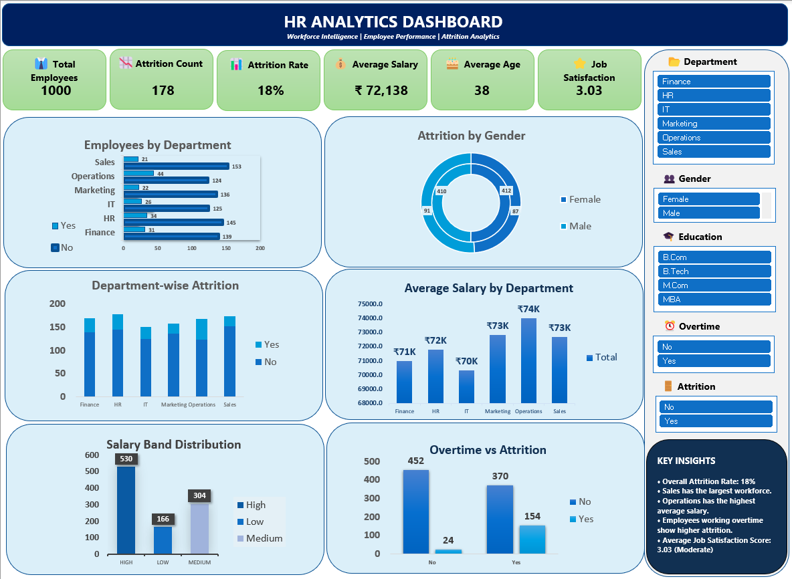

# 📊 HR Analytics Project using Microsoft Excel

An end-to-end **HR Analytics Project** developed in **Microsoft Excel**, demonstrating the complete analytics workflow—from **data cleaning** and **data analysis** to **interactive dashboard development** and **business insights**.

---

# 🖼 Dashboard Preview



---

# 📌 Project Overview

Organizations generate large volumes of employee data, but raw data alone cannot support effective decision-making.

This project transforms raw HR data into meaningful insights by performing:

- Data Cleaning
- Data Preparation
- Data Analysis
- KPI Development
- Interactive Dashboard Design
- Business Insight Generation

The final dashboard enables HR professionals and managers to monitor workforce performance, employee attrition, salary distribution, and other key HR metrics.

---

# 🎯 Project Objectives

- Clean and organize HR employee data
- Analyze workforce trends
- Measure employee attrition
- Compare department-wise performance
- Build an interactive Excel dashboard
- Support HR decision-making through data visualization

---

# 📂 Dataset Information

The dataset contains employee-related information including:

- Employee ID
- Department
- Gender
- Age
- Education
- Salary
- Overtime
- Job Satisfaction
- Attrition Status
- Years at Company

---

# 🔄 Project Workflow

```
Raw HR Dataset
       │
       ▼
Data Cleaning
       │
       ▼
Data Preparation
       │
       ▼
Pivot Tables & Analysis
       │
       ▼
KPI Calculation
       │
       ▼
Interactive Dashboard
       │
       ▼
Business Insights
```

---

# 📈 Dashboard KPIs

| KPI | Value |
|------|------:|
| 👥 Total Employees | 1000 |
| 📉 Attrition Count | 178 |
| 📊 Attrition Rate | 18% |
| 💰 Average Salary | ₹72,138 |
| 🎂 Average Age | 38 |
| ⭐ Job Satisfaction | 3.03 |

---

# 📊 Dashboard Features

- Employees by Department
- Department-wise Attrition
- Attrition by Gender
- Average Salary by Department
- Salary Band Distribution
- Overtime vs Attrition
- Interactive Slicers
- Executive KPI Cards
- Key Insights Panel

---

# 🛠 Tools & Skills Used

### Tools

- Microsoft Excel

### Excel Features

- Pivot Tables
- Pivot Charts
- Slicers
- Conditional Formatting
- Data Validation
- Excel Formulas

### Skills Demonstrated

- Data Cleaning
- Data Analysis
- Dashboard Design
- KPI Development
- Data Visualization
- Business Analytics
- HR Analytics

---

# 💡 Key Business Insights

- Overall employee attrition rate is **18%**.
- Sales has the largest workforce.
- Operations records the highest average salary.
- Employees working overtime show noticeably higher attrition.
- Average Job Satisfaction Score is **3.03**, indicating moderate employee satisfaction.

---

# 📁 Repository Structure

```
HR-Analytics-Project-Excel
│
├── HR_Analytics_project.xlsx
├── Dashboard screenshot.png
└── README.md
```

---

# 🚀 Future Enhancements

- Build the same dashboard in Power BI
- Automate data cleaning using Power Query
- Add dynamic Excel formulas and advanced KPIs
- Include trend analysis over time

---

# 👨‍💻 About Me

**Santhosh Selvaraj**

🎓 MBA (Business Analytics & Finance)

📊 Aspiring Business Analyst

### Connect with me

- LinkedIn: *(Add your LinkedIn profile URL here)*
- GitHub: https://github.com/Santhosh-BA

---

⭐ If you found this project interesting, consider giving it a **Star** on GitHub.
